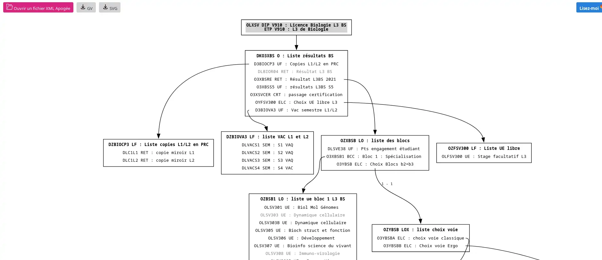
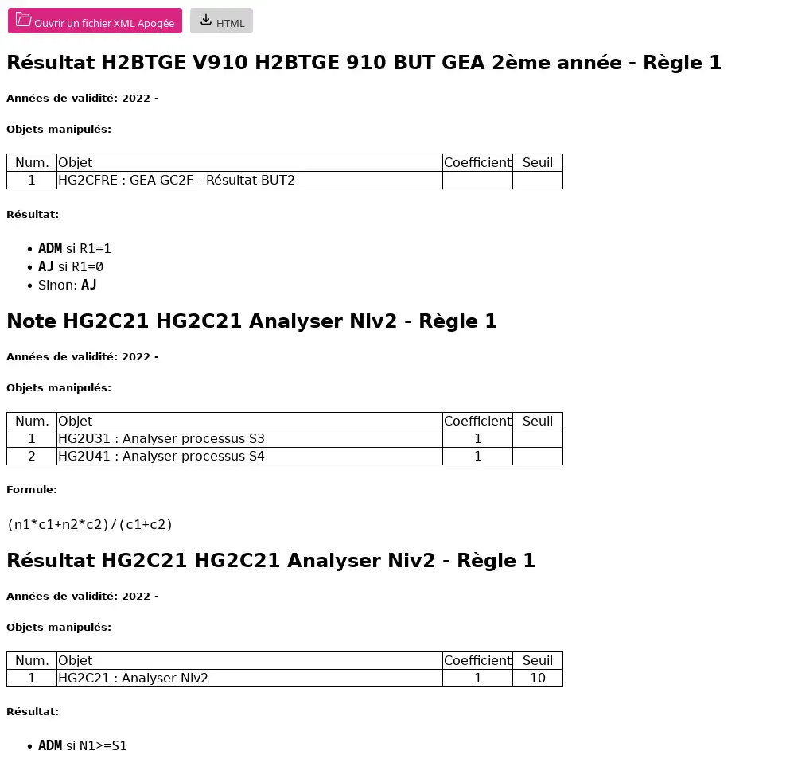
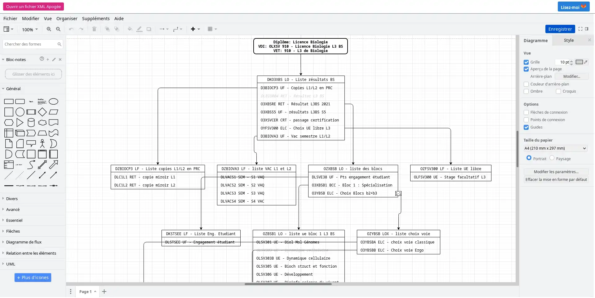

# apo2d-web

## Description

Ce projet contient :

- un outil de visualisation des "décompositions de diplômes" dans Apogée sous la forme de diagrammes Graphviz,
- un outil de génération d'un récapitulatif des règles de calcul des notes et résultats enregistrées dans Apogée,
- une interface Web (intégralement côté client) pour ces deux outils,
- une interface Web similaire pour le package Python [apogee2drawio](https://gitlab.dsi.universite-paris-saclay.fr/pavel.kalouguine/apogee2drawio), dont le but est aussi de créer des visualisations sous forme de diagrammes, mais au format [DrawIO](https://app.diagrams.net/).

## Démarrage rapide

### Visualisation d'une "décomposition de diplôme" (en fait, de version d'étape)

- Ouvrir Apogée et se connecter à votre base
- Menu Option/Basculer vers structure des enseignements
- Menu Documentation/Edition de la décomposition d'un diplôme
- Remplir le diplôme, la version de diplôme et l'étape
- Choisir Immédiat, "Visualisation Windows" comme imprimante, puis Imprimer
- Choisir XML
- Enregistrer le fichier

- Ouvrir l'interface Web à l'adresse https://www.imo.universite-paris-saclay.fr/~alexandre.janon/apogee2dot/
- Bouton "Ouvrir un fichier XML Apogée"
- Choisir le fichier enregistré plus haut
- Le diagramme de hiérarchie des éléments apparaît:

{width=650px}

### Visualisation des règles de calcul

- Ouvrir Apogée et se connecter à votre base
- Menu Option/Basculer vers modalités de contrôle
- Menu Documentation/Edition du détail des règles de calcul
- Remplir le diplôme, la version de diplôme et l'étape, l'année universitaire, etc.
- Choisir Immédiat, "Visualisation Windows" comme imprimante, puis Imprimer
- Choisir XML
- Enregistrer le fichier

Le reste de la procédure est identique à la visualisation d'une "décomposition de diplôme":

- Ouvrir l'interface Web à l'adresse https://www.imo.universite-paris-saclay.fr/~alexandre.janon/apogee2dot/
- Bouton "Ouvrir un fichier XML Apogée"
- Choisir le fichier enregistré plus haut
- Les règles de calcul apparaissent:

{width=650px}

### Diagrammes au format DrawIO

- Récupérer un fichier XML de décomposition de diplôme comme ci-dessus
- Ouvrir l'interface Web à l'adresse https://www.imo.universite-paris-saclay.fr/~alexandre.janon/apogee2drawio/
- Bouton "Ouvrir un fichier XML Apogée"
- Choisir le fichier enregistré plus haut
- Un diagramme DrawIO modifiable apparaît:

{width=650px}

## Installation en local

- Pour compiler l'outil en ligne de commande: `make`.
- Pour compiler l'interface Web et la tester en local: `make -C web serve`, puis diriger votre navigateur vers https://localhost:8000/ Cette compilation nécessite que [emscripten](https://www.emscripten.org) soit installé.
- Idem avec `make -C drawio-web serve` pour l'interface vers le package `apogee2drawio`.

## Contact

Mail: <alexandre.janon@universite-paris-saclay.fr>

En cas de problème, n'oubliez pas d'inclure le fichier XML Apogée que vous essayez de visualiser.

## Remerciements

- Pavel Kalouguine pour le package `apogee2drawio`
- Rafael Lopez pour le prototype d'interface Web vers le package `apogee2drawio`.

